# Analog Clock Reader — Software Diagrams

---

## 1. System Architecture (High-Level)

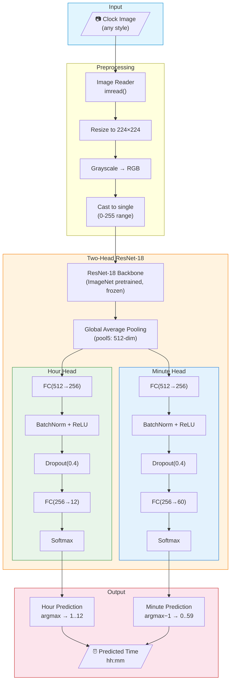

---

## 2. Complete Pipeline Flowchart

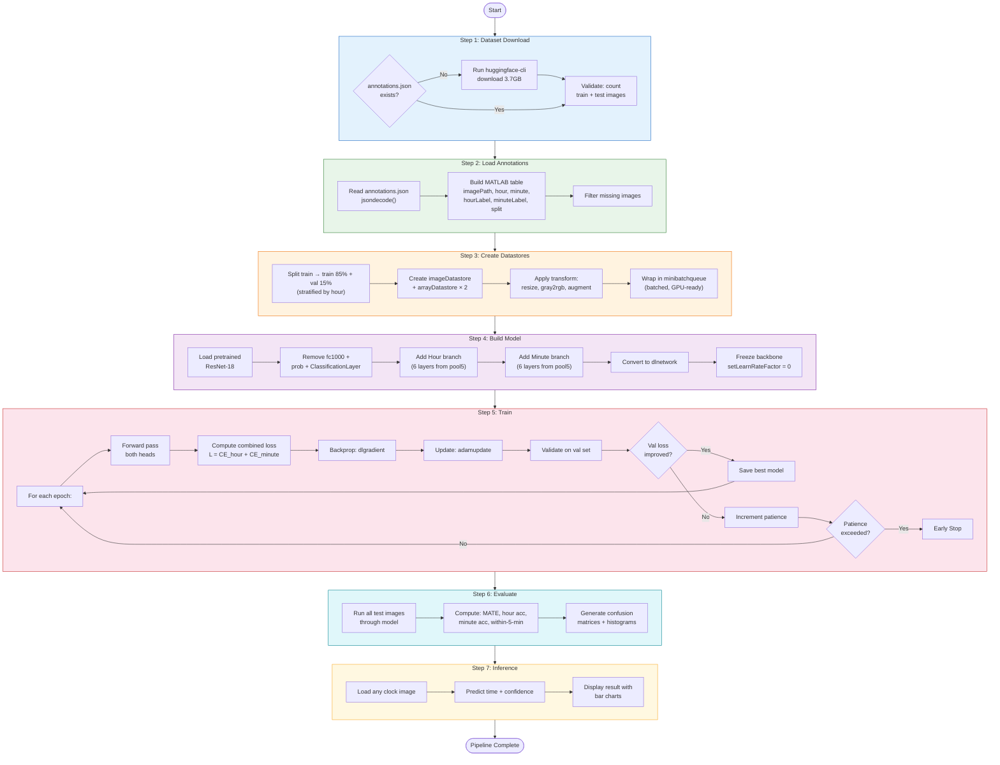

---

## 3. ResNet-18 Backbone Architecture (Layer Detail)

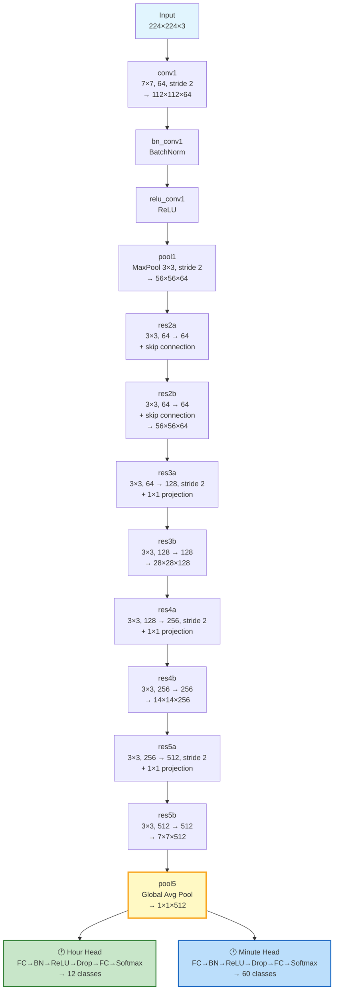

---

## 4. Data Flow Diagram

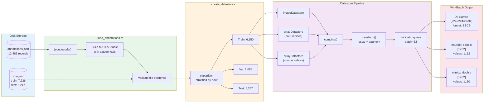

---

## 5. Training Loop Sequence Diagram

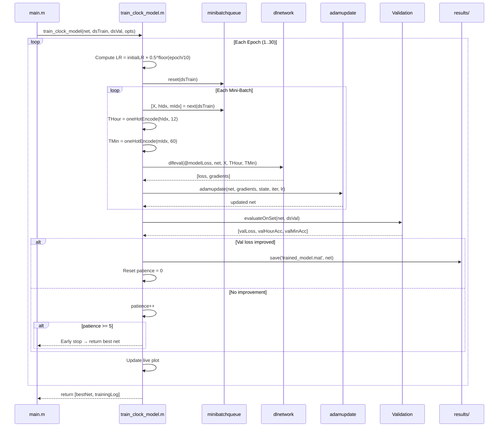

---

## 6. Model Loss Computation (Forward + Backward)

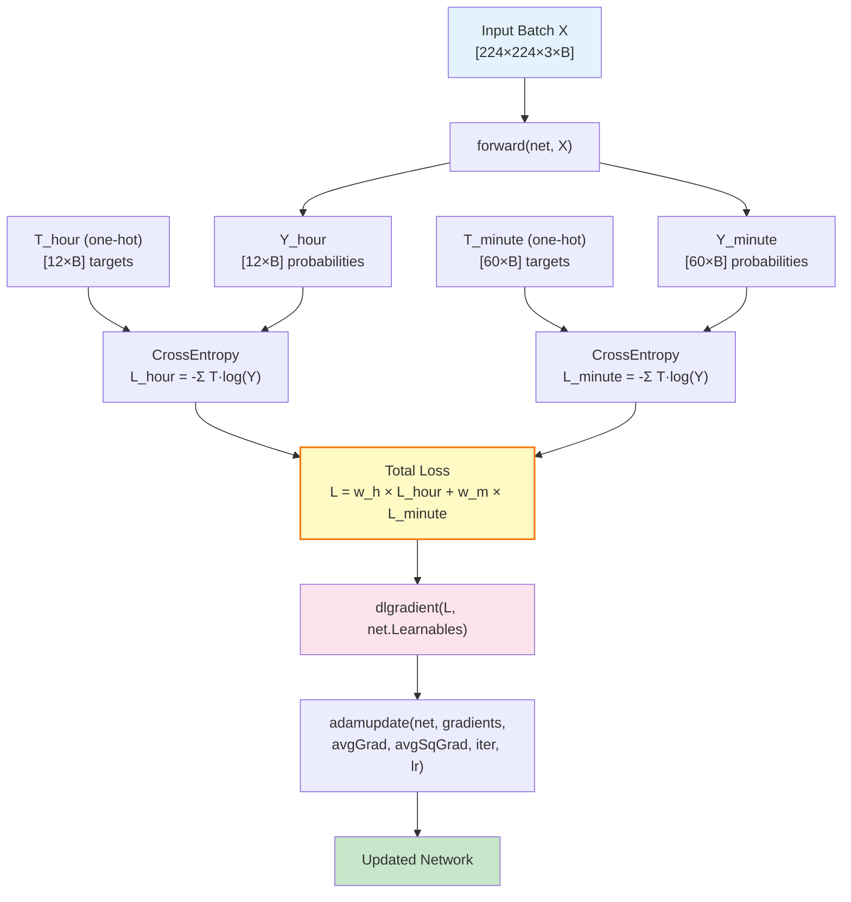

---

## 7. Evaluation Metrics Flow

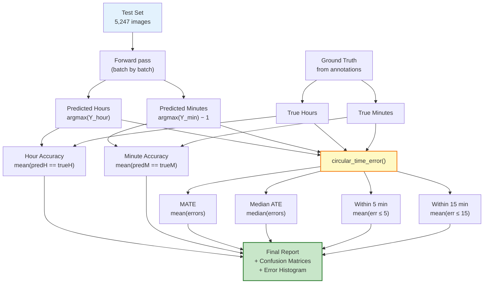

---

## 8. File Dependency Graph

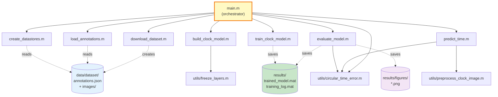

---

## 9. Circular Time Error Visualization

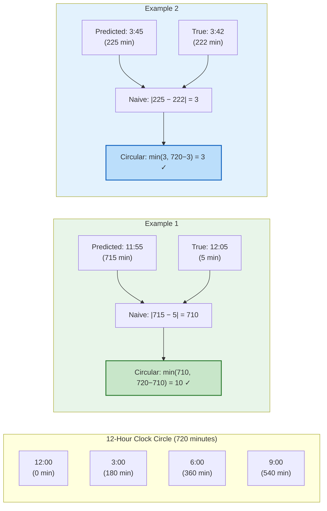

---

## 10. Transfer Learning Strategy

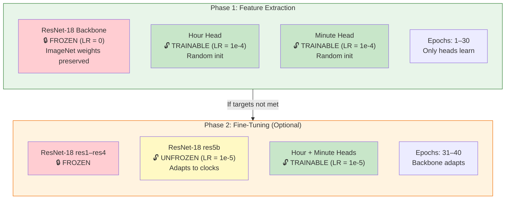

---

## 11. Augmentation Pipeline

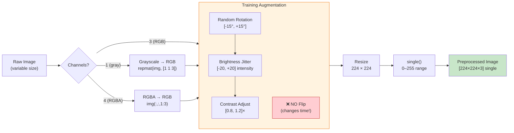

---

## 12. Early Stopping State Machine

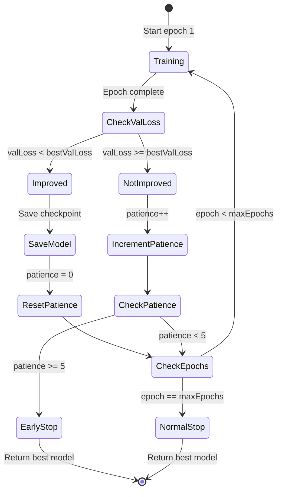

---

## 13. Inference Pipeline

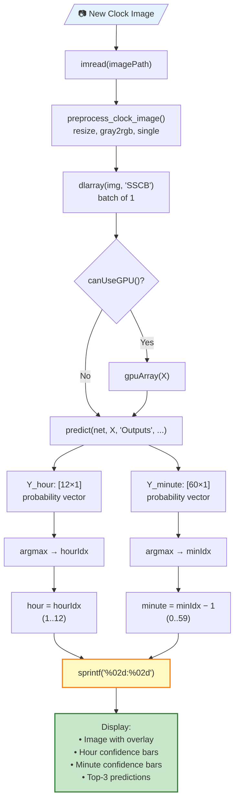

